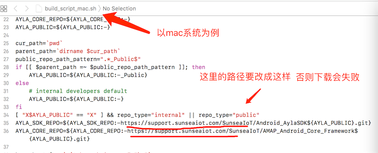
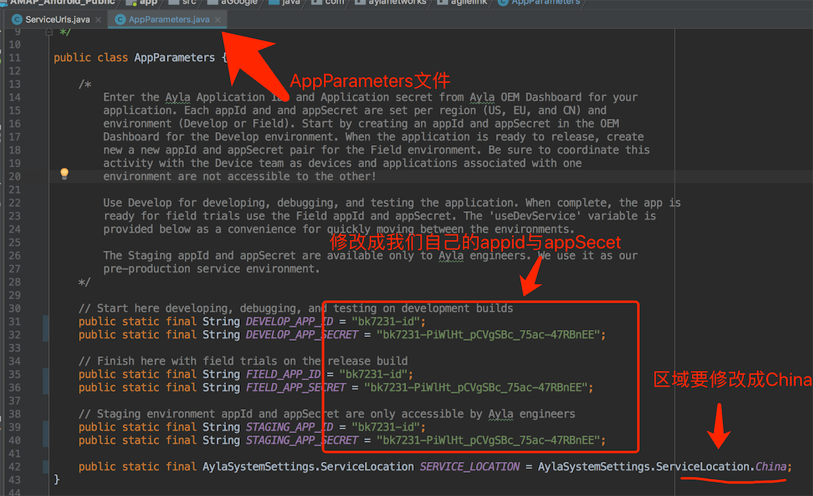
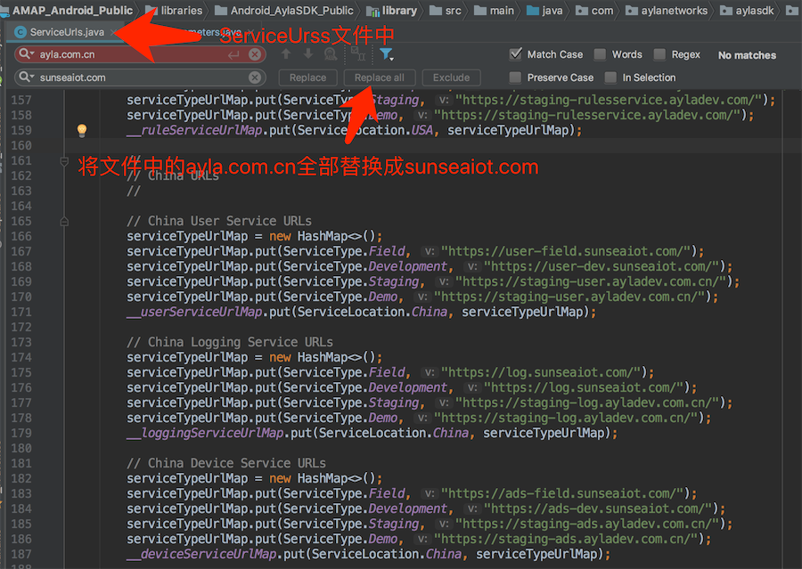
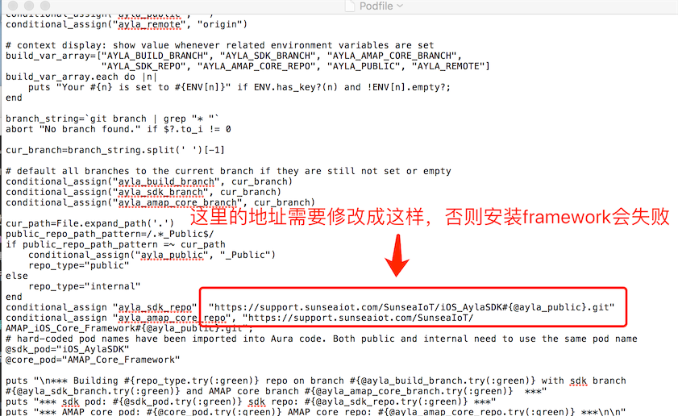
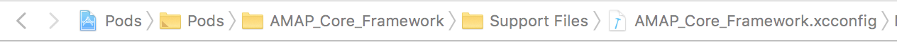
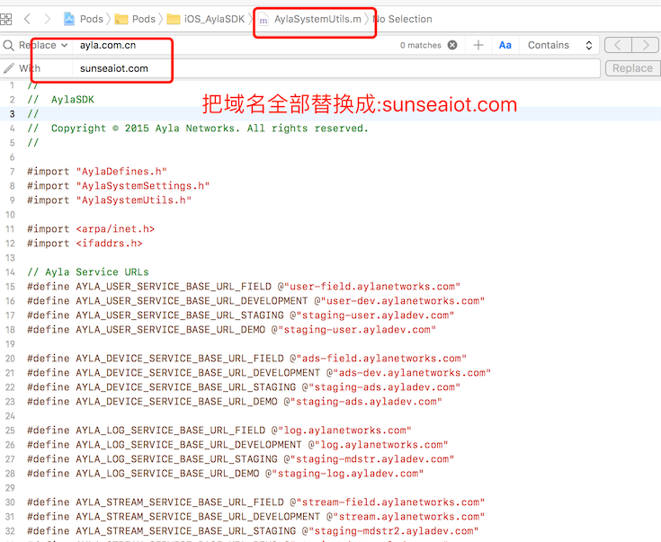
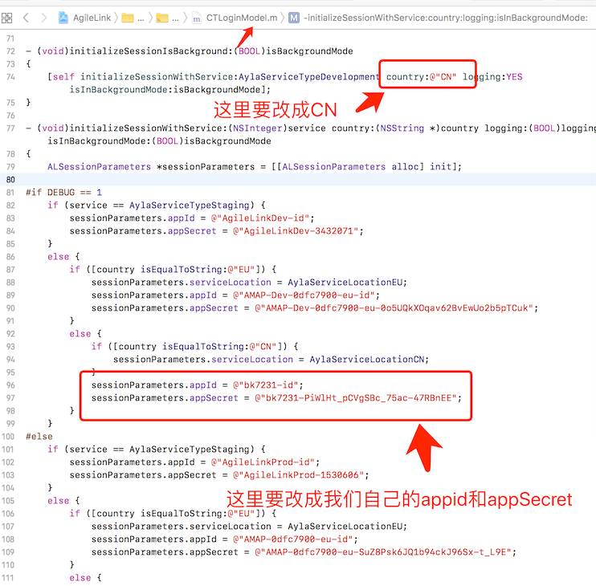
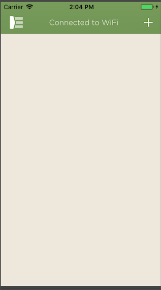

##### 测试账号信息：

````
 APP_ID: bk7231-id
 APP_SECRET: bk7231-PiWlHt_pCVgSBc_75ac-47RBnEE
 username:zhangping@belon.cn   //登陆用户名
 password:12345678             //登陆密码

````

------

##### Android编译方法与账号登陆问题：
*  下载最新版本（v5.8.00）的源码，下载方法：

````
  git clone -b sunseaiot_outlet https://support.sunseaiot.com/SunseaIoT/AMAP_Android_Public.git
  
  注意：源码一定要确保版本为：5.8.00
````

*  修改gradle_scripts目录下的编译脚本，如图：
*  依次执行如下命令，开始编译：

````
  1，cd AMAP_Android_Public/gradle_scripts
  2，../gradlew -q execTasks
````

*  编译成功后，就需要在源码里面修改appid、appSecret，并选择区域为:CHINA,如图：
* 由于产品需要出口到海外，需要修改服务器的域名，修改方法如图：
* 打包成功后，即可用上面的账号进行登陆；

-----
##### iOS编译方法与账号登陆问题：

* 下载最新版本（v5.8.00）的源码，下载方法：

````
  git clone -b v5.8.00 https://support.sunseaiot.com/SunseaIoT/AMAP_iOS_Public.git
  注意：一定要保证代码的版本
````
* 打开Podfile文件，修改下载Framework的地址，如图：
* 执行 pod install 安装第三方依赖的Fraemwork
* 安装完第三方依赖以后，如果AMAP_Core_Framework提示头文件找不到，我们需要AMAP_Core_Framework.xcconfig文件中的HEADER_SEARCH_PATHS：,修改后完整的文件内容如下：

````
CONFIGURATION_BUILD_DIR = ${PODS_CONFIGURATION_BUILD_DIR}/AMAP_Core_Framework
GCC_PREPROCESSOR_DEFINITIONS = $(inherited) COCOAPODS=1
HEADER_SEARCH_PATHS = "${PODS_ROOT}/Headers/Private" "${PODS_ROOT}/Headers/Private/AMAP_Core_Framework" "${PODS_ROOT}/Headers/Public" "${PODS_ROOT}/Headers/Public/AFNetworking" "${PODS_ROOT}/Headers/Public/AMAP_Core_Framework" "${PODS_ROOT}/Headers/Public/AMSlideMenu" "${PODS_ROOT}/Headers/Public/CocoaAsyncSocket" "${PODS_ROOT}/Headers/Public/CocoaHTTPServer" "${PODS_ROOT}/Headers/Public/CocoaLumberjack" "${PODS_ROOT}/Headers/Public/FirebaseAnalytics" "${PODS_ROOT}/Headers/Public/FirebaseCore" "${PODS_ROOT}/Headers/Public/FirebaseInstanceID" "${PODS_ROOT}/Headers/Public/GTMOAuth2" "${PODS_ROOT}/Headers/Public/GTMSessionFetcher" "${PODS_ROOT}/Headers/Public/Google" "${PODS_ROOT}/Headers/Public/GoogleMaps" "${PODS_ROOT}/Headers/Public/GooglePlaces" "${PODS_ROOT}/Headers/Public/GoogleSignIn" "${PODS_ROOT}/Headers/Public/GoogleToolboxForMac" "${PODS_ROOT}/Headers/Public/HexColors" "${PODS_ROOT}/Headers/Public/OCHamcrest" "${PODS_ROOT}/Headers/Public/OCMockito" "${PODS_ROOT}/Headers/Public/PDKeychainBindingsController" "${PODS_ROOT}/Headers/Public/QNNetDiag" "${PODS_ROOT}/Headers/Public/SAMKeychain" "${PODS_ROOT}/Headers/Public/SocketRocket" "${PODS_ROOT}/Headers/Public/TSMessages" "${PODS_ROOT}/Headers/Public/iOS_AylaSDK" "${PODS_ROOT}/Headers/Public/libPhoneNumber-iOS"
PODS_BUILD_DIR = ${BUILD_DIR}
PODS_CONFIGURATION_BUILD_DIR = ${PODS_BUILD_DIR}/$(CONFIGURATION)$(EFFECTIVE_PLATFORM_NAME)
PODS_ROOT = ${SRCROOT}
PODS_TARGET_SRCROOT = ${PODS_ROOT}/AMAP_Core_Framework
PRODUCT_BUNDLE_IDENTIFIER = org.cocoapods.${PRODUCT_NAME:rfc1034identifier}
SKIP_INSTALL = YES

````

* 打开AylaSystemUtils文件，进行域名替换：
* 修改appid与appSecret，修改方法如图：
* 运行登陆，登陆成功后如图：


### 新版下载地址
 
* Android

````
  git clone -b sunseaiot_outlet  https://support.sunseaiot.com/SunseaIoT/AMAP_Android_Public.git
  
````

* iOS

````
  git clone -b Powersocket_sunsea  https://support.sunseaiot.com/SunseaIoT/AMAP_iOS_Public.git
  
````

 

